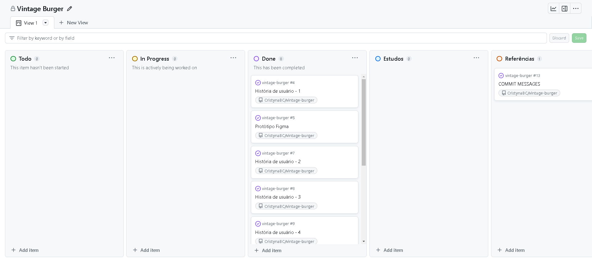

# Vintage Burger 🍔

   Acesse o projeto  [aqui](https://vintage-burger.vercel.app/).
   
  Status do projeto: Em andamento🚧  
  Ferramentas e tecnologias utilizadas:  

  
   
  
 

  ---

  

## Índice
- [1. Resumo do projeto](#1-resumo-do-projeto)
- [2. Histórias de usuários](#2-histórias-de-usuários)
- [3. Desenhos de interface do usuário](#3-desenhos-de-interface-de-usuário)
- [4. Instruções de login](#4-instruções-de-login)
- [5. Organização do projeto](#5-organização-do-projeto)
- [6. Testes unitários]()
- [7. Desenvolvedoras](#7-desenvolvedoras)

---
## 1. Resumo do projeto
Vintage Burger é uma hamburgeria inspirada no estilo dos restaurantes vintage dos anos 50. Mas apenas o estilo remete ao passado, pois, pensando em uma melhor experiência para seus colaboradores e almejando uma maior agilidade no atendimento ao cliente, foi criada uma interface moderna utilizando Angular CLI para melhor gerir o funcionamento da hamburgeria.

Existem três cargos dentro da hamburgueria: **administrador, chef de cozinha e garçom**. A interface foi desenvolvida com Angular CLI, pensando na melhor experiência possível de cada um dos três usuários. Os objetivos de cada um eram:
***
## 2. Histórias de usuários

- [x] **História de usuário 1:** Garçom/Garçonete deve poder entrar no sistema, caso o admin já lhe tenha dado as credenciais: 
 *"Eu, como garçom/garçonete quero entrar no sistema de pedidos."*

- [x] **História de usuário 2:** Garçom/Garçonete deve ser capaz de anotar o pedido do cliente:  
*"Eu como garçom/garçonete quero poder anotar o pedido de um cliente para não depender da minha memória, saber quanto cobrar e poder enviar os pedidos para a cozinha para serem preparados em ordem."*

- [x] **História de usuário 3:** Chefe de cozinha deve ver os pedidos: 
*"Eu como chefe de cozinha quero ver os pedidos dos clientes em ordem, poder marcar que estão prontos e poder notificar os garçons/garçonetes que o pedido está pronto para ser entregue ao cliente."*

- [x] **História de usuário 4:** Garçom/Garçonete deve ver os pedidos prontos para servir:  
*"Eu como garçom/garçonete quero ver os pedidos que estão prontos para entregá-los rapidamente aos clientes."*

- [x] **História de usuário 5:** Administrador(a) de loja deve administrar seus funcionários:  
*"Eu como administrador(a) de loja quero gerenciar os usuários da plataforma para manter atualizado as informações de meus funcionários."*

- [x] **História de usuário 6:** Administrador(a) de loja deve administrar os produtos:  
*"Eu como administrador(a) de loja quero gerenciar os produtos para manter atualizado o menu."*

***
## 3. Desenhos de interface de usuário

Os protótipos do projeto foram feitos em Figma. Você pode acessá-los aqui:

- [Protótipo garçom](https://www.figma.com/proto/awhL0NTG7GXhDwJxegvw4A/Vintage-Burger?type=design&node-id=11-375&t=y9I1IXEpI3i0nPNe-1&scaling=scale-down&page-id=6%3A847&starting-point-node-id=11%3A375&mode=design).

- [Protótipo chef](https://www.figma.com/proto/awhL0NTG7GXhDwJxegvw4A/Vintage-Burger?type=design&node-id=106-932&t=pYn42YANldLaxAY2-1&scaling=scale-down&page-id=3%3A2&starting-point-node-id=106%3A932&show-proto-sidebar=1&mode=design).

- [Protótipo admin](https://www.figma.com/proto/awhL0NTG7GXhDwJxegvw4A/Vintage-Burger?type=design&node-id=106-1258&t=Sl11WG2duDFXlNsB-1&scaling=scale-down&page-id=106%3A1147&starting-point-node-id=106%3A1258&show-proto-sidebar=1&mode=design).

Ao longo do desenvolvimento do projeto, após a realização de testes de usabilidade, foi optado por alterar a visualização de lista de produtos e colaboradores por parte do admin, deixando de ser em cards e passando a ser em tabelas.

## 4. Instruções de login
  Você pode acessar com as seguintes credenciais:  

| Cargo           | Email                  | Senha  |
|-----------------|------------------------|--------|
| Administrador   | claudia@vburger.com    | 123456 |
| Chef de cozinha | joao@vburger.com       | 123456 |
| Garçom          | pedro@vburger.com      | 123456 |

***
## 5. Organização do projeto
A organização do projeto foi feita seguindo conceitos do método scrum, e utilizando a ferramenta GitHub Projects para administração das sprints:

***

## 7. Desenvolvedoras
Cristyna Costa

 

Geane Ramos

 
